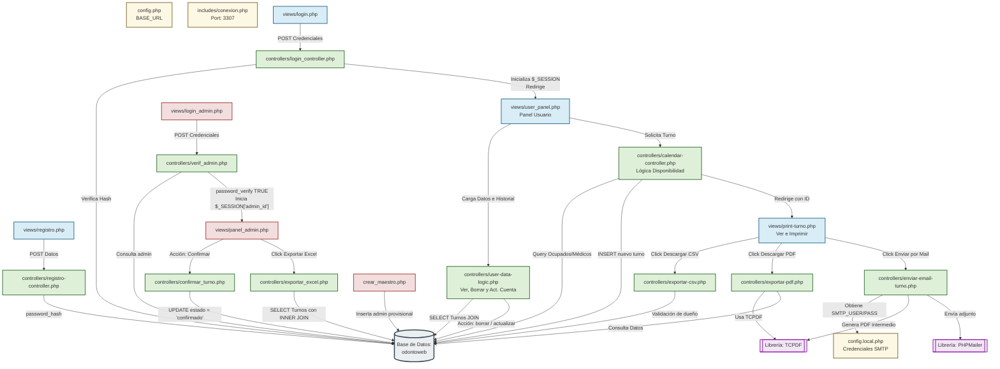

# 🦷 ODONTOWEB - Sistema de Gestión Odontológica

**ODONTOWEB** es una solución integral para la gestión de clínicas dentales, diseñada para optimizar la interacción entre pacientes y profesionales. El sistema permite una reserva de turnos fluida, administración de especialistas y exportación de datos críticos para la gestión administrativa.

## 🚀 Funcionalidades Clave
- **Calendario Dinámico:** Interfaz visual para la selección de turnos con validación de disponibilidad en tiempo real.
- **Gestión de Especialidades:** Filtros inteligentes por Odontología General, Ortodoncia, Implantes y Blanqueamiento.
- **Panel de Usuario:** Los pacientes pueden gestionar sus perfiles y visualizar sus citas programadas.
- **Exportación de Datos:** Herramienta integrada para exportar confirmaciones y listados de turnos en formato **CSV** y **PDF**.
- **Seguridad:** Sistema de login con validación de sesiones, roles diferenciados y hashing de contraseñas.
- **Comunicación:** Integración con PHPMailer para notificaciones y botones de contacto directo.

## 🛠️ Stack Tecnológico
- **Backend:** PHP 8.x
- **Base de Datos:** MySQL
- **Frontend:** HTML5, CSS3 (Diseño responsivo y modular)
- **Lógica de Negocio:** Arquitectura basada en Controladores y Vistas (MVC-ish).

## 📋 Requisitos e Instalación
1. Clonar el repositorio: `git clone https://github.com/tu-usuario/ODONTOWEB.git`
2. Importar la base de datos `odontoweb.sql` en tu servidor local (XAMPP/WAMP).
3. Configurar las credenciales en `config.php`.
4. Acceder a `localhost/ODONTOWEB/views/login.php`.

## 🔩 Diagrama de Arquitectura y Relaciones Completo

```text
<div align="center" style="background-color: white; padding: 20px; border-radius: 10px;">


<\div>

## 📂 Estructura del Proyecto
El proyecto sigue una arquitectura modular para separar la lógica de negocio de la interfaz de usuario:

```
ODONTOWEB/
├── controllers/          # Lógica de control y procesamiento de datos
│   ├── calendar-controller.php   # Lógica del calendario y disponibilidad
│   ├── exportar-pdf.php          # Generación de reportes con TCPDF
│   ├── exportar-csv.php          # Exportación de turnos a Excel/CSV
│   ├── login_controller.php      # Autenticación de pacientes y admins
│   └── ... (registro, email, gestión de doctores)
│
├── includes/             # Componentes reutilizables y configuración base
│   ├── conexion.php              # Conexión centralizada a MySQL
│   ├── header.php / footer.php   # Elementos comunes de la interfaz
│   └── ...
│
├── lib/                  # Librerías externas (instalación manual)
│   └── TCPDF/                    # Motor de generación de PDF
│
├── models/               # Archivos de base de datos
│   └── odontoweb.sql             # Estructura y datos iniciales de las tablas
│
├── public/               # Recursos estáticos accesibles por el navegador
│   ├── css/                      # Hojas de estilo modulares (login, user, calendar)
│   ├── img/                      # Imágenes del sitio y galería de profesionales
│   └── img/screenshots/          # Capturas de pantalla para documentación
│
├── views/                # Interfaz de usuario (Páginas finales)
│   ├── login.php                 # Acceso para pacientes
│   ├── turno.php                 # Interfaz de reserva de turnos
│   ├── user_panel.php            # Panel de gestión del paciente
│   └── ... (panel_admin, registro, vista de impresión)
│
├── vendor/                  # Librerías externas ocultas (instalación manual)
│   └── PHPmailer/                    # Motor de envío de email
├── config.php            # Configuración de rutas y constantes globales
├── index.php             # Punto de entrada principal
└── README.md             # Documentación del proyecto
```

## ✒️ Autores
   - Matias Roberto Cortinez - Desarrollador y Técnico Electrónico - MCortinez-dev
   - Damian Dominguez - Desarrollador - Damianmdominguez

## 📸 Screenshots


