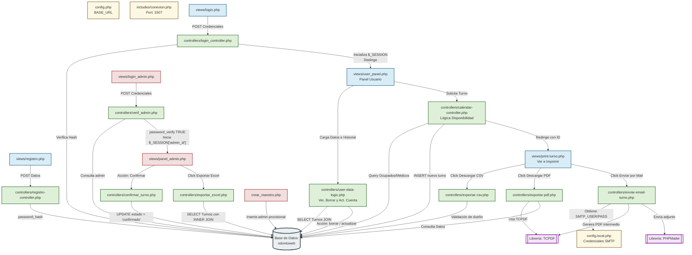
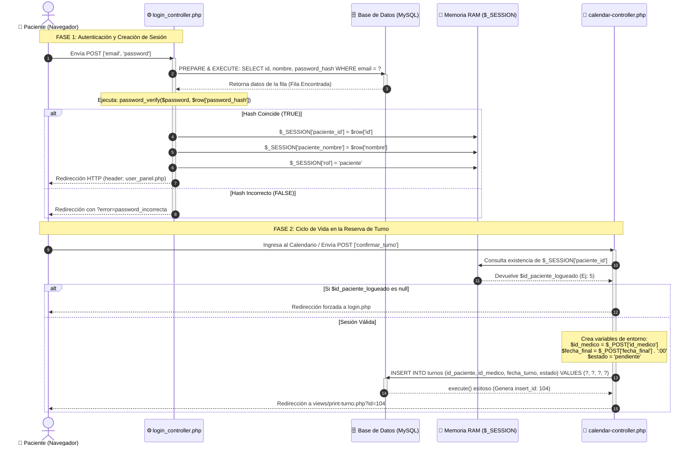

# OdontoWeb 🦷

Sistema web dinámico para la gestión de clínicas odontológicas, reserva de turnos en tiempo real y administración de pacientes y profesionales. Desarrollado con una arquitectura limpia en PHP nativo, MySQL y JavaScript.

## 🚀 Funcionalidades Clave

### 👤 Módulo de Pacientes
* **Registro Seguro y Blindado:** Proceso de alta sanitizado tanto en cliente (JavaScript) como en servidor (Sentencias preparadas), verificando de forma estricta la no duplicidad de identificadores críticos como DNI o Correo Electrónico.
* **Portal Auto-gestionable (Panel de Usuario):** Espacio personalizado para visualizar el historial completo de turnos vigentes, cancelar citas agendadas de forma transparente y actualizar datos de contacto (Nombre, Apellido, Teléfono, Correo Electrónico y Contraseña) con re-hashing criptográfico automático.
* **Centro de Comprobantes Interactivos:** Pantalla dedicada para la emisión de constancias de citas donde el paciente puede:
    * Descargar el comprobante legalizado en formato **PDF** de manera instantánea (generado mediante el motor nativo TCPDF).
    * Exportar la ficha técnica de la cita en un archivo estructurado **CSV** compatible con Microsoft Excel.
    * Despachar una copia digital del comprobante directamente a su **Correo Electrónico** mediante un canal seguro SMTP automatizado con PHPMailer.

### 🗓️ Motor de Agenda y Calendario Dinámico
* **Cálculo de Disponibilidad Concurrente:** El sistema agrupa las reservas activas y las contrasta en tiempo real con el volumen de profesionales odontológicos disponibles para una determinada especialidad y franja horaria (*Mañana* o *Tarde*). Si la capacidad operativa está al límite, el horario se bloquea automáticamente evitando el *overbooking*.
* **Filtros de Control Temporal:** Restricción automatizada que impide la selección de días pasados o fines de semana (Sábados y Domingos se muestran como 'Cerrado' con desactivación de eventos en interfaz).
* **Control Antitransaccional:** Mecanismo en Frontend que bloquea e inhabilita los botones de confirmación ante el clickeo ansioso del usuario, garantizando la unicidad e integridad del registro en la base de datos.

### 🔐 Módulo de Administración (Panel Interno)
* **Filtros Avanzados de Auditoría:** Buscador dinámico que permite al personal administrativo indexar y filtrar el universo de turnos en base al DNI o el Apellido de los pacientes.
* **Gestión Operativa de Citas:** Herramienta directa para la confirmación de turnos en estado 'Pendiente', actualizando los estados transaccionales en la base de datos de manera inmediata.
* **Reportería Ejecutiva Dinámica:** Módulo de exportación directa que vuelca el set de datos filtrado en pantalla hacia un archivo de hoja de cálculo nativo de **Excel (.xls)** con estilos limpios y estructurados para auditorías internas.

---

## 🛠️ Stack Tecnológico

* **Backend Core:** PHP 7.x / 8.x (Programación estructurada con fuerte enfoque en Seguridad Transaccional y Patrón Controlador/Vista).
* **Motor de Base de Datos:** MySQL (Estructura relacional con restricciones de integridad y claves foráneas).
* **Frontend Nativo:** HTML5, CSS3 (Arquitectura modular con hojas de estilo segmentadas por componentes, layouts fluidos y adaptabilidad *Responsive Mobile* mediante Grid y Flexbox) y JavaScript Nativo (Manipulación avanzada del DOM, control de flujo asincrónico por eventos y API `URLSearchParams` para gestión de estados).
* **Librerías Core Integradas (Sin dependencias externas pesadas/Composer):**
    * **TCPDF (v6.x):** Motor nativo para la renderización y dibujo vectorial de reportes e imágenes en formato PDF.
    * **PHPMailer (v6.x):** Cliente SMTP orientado a objetos utilizado para el transporte seguro de correos (soporte TLS/STARTTLS y codificación base64 para adjuntos).

---

## 📦 Instalación y Configuración Local

Seguí estos pasos para clonar y ejecutar el proyecto en tu entorno de desarrollo local:

### 1. Requisitos Previos
- Tener instalado [XAMPP](https://www.apachefriends.org/) o Laragon con PHP 8.0 o superior.
- Tener instalado Git.

### 2. Clonar el Repositorio
Navegá hasta la carpeta de tu servidor local (por ejemplo, `C:/xampp/htdocs/`) abre la terminal y ejecutá:
```bash
git clone [https://github.com/MCortinez-dev/OdontoWeb.git](https://github.com/MCortinez-dev/OdontoWeb.git)
cd OdontoWeb
```
Asegúrese de que el directorio del proyecto mantenga el nombre exacto de la carpeta en mayúsculas/minúsculas si sus configuraciones de Apache son estrictas: ODONTOWEB o OdontoWeb.

### 3. Configuración y Despliegue de la Base de Datos
-. Inicie los módulos de Apache y MySQL desde el Panel de Control de XAMPP.
-. Acceda a su navegador web e ingrese a la interfaz de administración de bases de datos: http://localhost/phpmyadmin/.
-. Cree una nueva base de datos llamada exactamente odontoweb.
-. Seleccione la base de datos recién creada, diríjase a la pestaña "Importar", haga clic en "Seleccionar archivo" y busque el archivo de inicialización ubicado en: models/odontoweb.sql.
-. Haga clic en el botón "Importar" (o "Continuar") en la parte inferior para ejecutar las estructuras de tablas e insertar las semillas de especialidades y médicos precargados.
🔍 Nota Técnica sobre el Puerto de Conexión: > Por diseño del equipo, el archivo de conexión centralizado (includes/conexion.php) está configurado de forma predeterminada para conectarse al puerto 3307 de MySQL. Si su servidor XAMPP corre bajo el puerto clásico de MySQL (3306), abra el archivo includes/conexion.php y modifique la variable:
```php
$port = "3306"; // Cambie de 3307 a 3306 según la configuración de su motor local
```

### 4. Configuración de Credenciales del Servidor de Correo (SMTP)
-. El sistema requiere acceso a un servidor de correos seguro para despachar las notificaciones a los pacientes.
-. En la raíz del proyecto, busque el archivo plantilla llamado config.sample.php.
-. Saque una copia de este archivo y renombre la copia como config.local.php.
-. Abra config.local.php e ingrese sus credenciales de Gmail reales. Si utiliza autenticación en dos pasos de Google, recuerde generar una Contraseña de Aplicación dedicada de 16 caracteres:
```php
<?php
define('SMTP_USER', 'tu_correo_cuenta@gmail.com');
define('SMTP_PASS', 'abcd efgh ijkl mnop'); // Clave de aplicación de Google
?>
```

### 5. Creación del Usuario Administrador Principal (Maestro)
Para poder ingresar por primera vez al panel de auditoría administrativa:
-. Abra su navegador web y ejecute de forma directa el archivo de inicialización: http://localhost/ODONTOWEB/crear_maestro.php.
-. El sistema le mostrará un mensaje confirmando la creación exitosa del perfil administrativo con las credenciales por defecto:
Usuario: admin
Contraseña: admin123
🚨 IMPORTANTE POR SEGURIDAD: Una vez que visualice el cartel de éxito en pantalla, elimine el archivo crear_maestro.php de su servidor para evitar que usuarios externos puedan sobreescribir la cuenta administrativa.

### 6. Acceso al Sistema
Ya tiene el entorno configurado. Puede navegar de forma directa por la aplicación:
-. Portal Público (Inicio/Reserva): http://localhost/ODONTOWEB/index.php
-. Acceso directo a Login de Pacientes: http://localhost/ODONTOWEB/views/login.php
-. Acceso directo al Panel de Administradores: http://localhost/ODONTOWEB/views/login_admin.php

## 🔩 Diagrama de Arquitectura y Relaciones Completo



## 📟 Diagrama de Secuencia



## 📂 Estructura del Proyecto
El proyecto sigue una arquitectura modular para separar la lógica de negocio de la interfaz de usuario:

```text
ODONTOWEB/
├── config.php                  # Configuración global del sistema y definición de la constante BASE_URL
├── config.local.php            # Credenciales SMTP de producción (excluido de Git por seguridad)
├── config.sample.php           # Plantilla de referencia para credenciales SMTP locales
├── index.php                   # Portal de entrada público de la clínica con carrusel e información institucional
├── crear_maestro.php           # Script provisional para inicializar el Administrador Principal (Maestro)
├── controllers/                # CAPA LOGICA: Procesamiento de datos y orquestación con la BD
│   ├── calendar-controller.php   # Lógica algorítmica del calendario, bloqueos y disponibilidad de médicos
│   ├── login_controller.php      # Autenticación, control de hashes y apertura de $_SESSION para Pacientes
│   ├── verif_admin.php           # Validación de accesos y credenciales para el perfil de Administrador
│   ├── registro-controller.php   # Sanitización, validación anti-duplicidad e inserción de nuevos Pacientes
│   ├── user-data-logic.php       # Orquestador del panel: SELECT de historial, UPDATE de datos y DELETE de cuenta
│   ├── exportar-pdf.php          # Inicialización y renderizado binario del PDF vía TCPDF para descarga directa
│   ├── exportar-csv.php          # Generación y manipulación del stream 'php://output' para exportación CSV
│   ├── exportar_excel.php        # Construcción de tablas HTML con cabeceras MIME para descarga nativa de Excel
│   ├── enviar-email-turno.php    # Acoplamiento de TCPDF + PHPMailer para envío de adjuntos vía SMTP
│   ├── confirmar_turno.php       # Lógica transaccional para cambiar estados de citas por parte del Admin
│   ├── logout.php                # Destrucción selectiva de la sesión del Paciente y redirección limpia
│   └── logout_admin.php          # Destrucción selectiva de la sesión del Administrador
├── includes/                   # COMPONENTES REUTILIZABLES: Fragmentos de código comunes e inyecciones
│   ├── conexion.php              # Centralización de la conexión PDO/MySQLi (Seteo de puerto 3307 y control de errores)
│   ├── header.php                # Barra de navegación superior dinámica con lógica inyectada de menú hamburguesa
│   ├── footer.php                # Pie de página institucional, iframe de Google Maps y botón flotante de WhatsApp
│   └── funcion.js                # Archivo JavaScript centralizado con funciones utilitarias globales (`mostrarAlerta`)
├── models/                     # CAPA DE DATOS: Estructura e inicialización de la persistencia
│   └── odontoweb.sql             # Esquema relacional completo de tablas, restricciones UNIQUE e inserción de semillas (Seeders)
├── public/                     # ACTIVOS PUBLICOS: Recursos estáticos accesibles por el navegador
│   ├── css/                      # Hojas de estilo segmentadas por componentes (calendar, style, login, print, etc.)
│   └── img/                      # Banco de imágenes estáticas, carrusel promocional y logotipo de la empresa
└── vendor/                     # DEPENDENCIAS CORE: Código fuente aislado de librerías de terceros (PHPMailer)
```

## ✒️ Autores
   - Matias Roberto Cortinez - Desarrollador y Técnico Electrónico - MCortinez-dev
   - Damian Dominguez - Desarrollador - Damianmdominguez

## 📸 Screenshots


